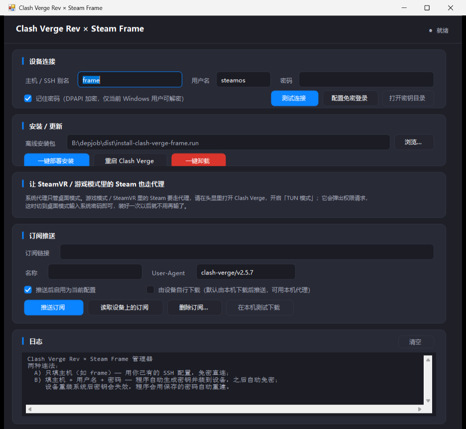

# Clash Verge Rev × Steam Frame 适配

把 [clash-verge-rev](https://github.com/clash-verge-rev/clash-verge-rev) 适配到 Valve **Steam Frame**
（Qualcomm Snapdragon 8 Gen 3 / **AArch64** / **SteamOS**），并给出真机验证过的一键安装方案。

> **已验证**：2026-10-07 在真实 Steam Frame 开发机（SteamOS `VARIANT_ID=vr`，`BUILD_ID=20261006`，
> 内核 6.18.0，glibc 2.39）上完成安装、启动、渲染、内核接管、托盘、Steam 库注册的端到端验证。

---

## 一、真机实测：Steam Frame 与普通 SteamOS（Steam Deck）的差异

这是本次适配最核心的情报，全部来自 `frame` 实机，不是推测。

| 维度 | Steam Deck（普通 SteamOS） | **Steam Frame** | 对适配的影响 |
|---|---|---|---|
| 架构 | `x86_64` | **`aarch64`** | 只能用 arm64 产物，x86 的 deb/AppImage 全废 |
| SoC | AMD APU | **Snapdragon 8 Gen 3**（2×A520 + 5×A720 + 1×） | — |
| 系统标识 | `VARIANT_ID=steamdeck` | **`VARIANT_ID=vr`** | 判断机型的唯一可靠依据 |
| pacman 仓库 | `holo` / `jupiter` | **`archlinux-deckard`**（Deckard 是 Frame 内部代号）+ `deckard-arch-hotfixes-release-0.4` | 仓库内容被裁剪过 |
| 根文件系统 | 只读 | **只读**（btrfs，`/` 标 `rw` 但写入被拒） | 必须装到 `/home` |
| `/home` 空间 | 分区可写 | 独立 ext4，**177 GB 可用** | 应用装这里的正解 |
| glibc | 2.3x | **2.39** | Ubuntu 22.04 构建的产物（glibc 2.35）可直接跑 |
| x86 转译 | 无 | **FEXBash 已注册进 binfmt_misc** | 默认能跑 x86-64 程序 |
| 安卓运行时 | 无 | **Lepton（AOSP 运行时，支持 APK 侧载）** | 存在 `~/.android`、`steamos-add-to-steam` 认 APK |
| GUI 会话 | gamescope + Plasma | **gamescope-wayland + SDDM + Plasma**，`DISPLAY=:0` | SSH 里也能拉起窗口做冒烟测试 |
| **webkit2gtk-4.1** | 需自行安装 | **未预装**，但 **Valve 官方仓库里有**（`extra/webkit2gtk-4.1 2.44.1-1`） | 唯一缺失的运行时依赖 |
| **libayatana-appindicator** | AUR | **仓库没有、AUR 也没有**（AUR RPC 返回 0 条） | 托盘需自带 |
| 非 Steam 应用入口 | `steamos-add-to-steam` | **`steamos-add-to-steam`，且额外有 `X-Steam-Special=Desktop` 的 Frame 专用启动器** | 这才是"安装"的正解 |
| "右键安装" | 不存在 | **不存在** | `application/vnd.appimage` 无任何注册处理器 |

### 关于"右键安装"

**SteamOS 上没有"右键安装"这个概念**，Steam Frame 也没有。实测：

* `application/vnd.appimage` → **没有注册任何处理器**
* `application/vnd.debian.binary-package` → 关联到 KDE Discover，但 Discover 的 PackageKit 后端是 `inactive`，
  而且 Arch 系根本不认 deb
* 根文件系统只读 → deb/rpm 即使有处理器也装不进去

Frame 上真正等价的做法是：

```bash
steamos-add-to-steam "/home/steamos/.local/share/applications/clash-verge.desktop"
```

它会执行 `steam "steam://addnonsteamgame/<路径>"`，把条目写进
`~/.local/share/Steam/userdata/<id>/config/shortcuts.vdf`，随后应用就出现在
**Steam Frame 的库 / 非 Steam 应用启动器**里。`steamos-add-to-steam` 接受
`.desktop`、可执行文件、**AppImage** 和 shell 脚本。

本方案的安装器 **会自动完成这一步**。

---

## 二、为什么不能做成"自带 WebKit 的 AppImage"

这是本次适配最关键的技术结论，直接改变了交付形态。

Tauri 应用的 Linux AppImage 通常靠 `linuxdeploy-plugin-gtk` 把 GTK/WebKit 一起打包，做到"单文件自包含"。
但在 SteamOS 上这条路走不通：

```
libwebkit2gtk-4.1.so.0        => not found      ← 真机 ldd 结果，只有这两个缺失
libjavascriptcoregtk-4.1.so.0 => not found
```

WebKitGTK 的**辅助进程路径是编译期硬编码的**。对官方 `libwebkit2gtk-4.1.so.0.13.5` 做 `strings`：

```
/usr/lib/webkit2gtk-4.1
/usr/lib/webkit2gtk-4.1/injected-bundle/
```

**这个构建里根本不存在 `WEBKIT_EXEC_PATH`**（把所有 `WEBKIT_*` 字符串列出来，只有
`WEBKIT_CHANNEL` / `WEBKIT_DEBUG` / `WEBKIT_SUBSYSTEM` / `WEBKIT_USE_PORTAL` 等，没有 exec path）。
所以当 WebKit 要拉起子进程时，只会去 `/usr/lib/webkit2gtk-4.1/` 找，实测报错：

```
Unable to spawn a new child process: Failed to spawn child process
?/usr/lib/webkit2gtk-4.1/WebKitNetworkProcess? (No such file or directory)
```

试过的替代方案与结论：

| 方案 | 结果 |
|---|---|
| `WEBKIT_EXEC_PATH` 重定位 | ❌ 该构建不支持此变量 |
| `bwrap` 把自带目录 bind 到 `/usr/lib/webkit2gtk-4.1` | ❌ `Can't mkdir /usr/lib/webkit2gtk-4.1: Read-only file system` |
| 非特权 user namespace | ✅ `unshare -Urm` 可用（但 bind 到只读路径仍需先有该挂载点） |
| 二进制补丁改字符串 | ⚠️ 可行但脆弱：要保证新路径长度不超过原路径，且等于自行维护一份 WebKit |

**所以正确做法是：让系统提供 WebKit，而不是硬塞进 AppImage。**

好在 Valve 自己在官方仓库里就维护了 `webkit2gtk-4.1`——这反而**更安全**（随系统更新获得安全补丁），
代价是系统大版本更新后需要重跑一次安装器。

至于 **`libayatana-appindicator3`（托盘）**：它是 **`dlopen` 运行时加载**，不是硬依赖
（`libappindicator-sys 0.9.0` 用 `libloading`），所以**只要把它放到库搜索路径里就行**，
不需要 AUR、不需要编译。本方案的安装器会从 Arch Linux ARM 官方仓库取现成的 aarch64 二进制补上。

---

## 三、安装

### 前置条件

* Steam Frame（或任何 SteamOS aarch64 机器）
* 用户 `steamos` 有 sudo 权限（安装 webkit 需要一次 root）
* 用网络模式时需要联网；用单文件离线包时**完全不需要联网**

---

### 方式 A：单文件离线安装包（最推荐，开箱即装）

`install-clash-verge-frame.run` —— **120 MB 单文件，自带全部依赖**：

| 内嵌内容 | 大小 | 说明 |
|---|---|---|
| `Clash.Verge_2.5.7_arm64.deb` | 95 MB | 上游官方 ARM64 程序本体 |
| `webkit2gtk-4.1` + 6 个依赖包 | 27 MB | 来自 Valve 官方 SteamOS 仓库（`.pkg.tar.zst`） |
| `libayatana-appindicator3` / `libayatana-indicator3` | 268 KB | 托盘库，来自 Arch Linux ARM 官方仓库 |

**它不下载任何东西。** 这在 Steam Frame 上很重要——机器上本来就没有代理，装代理工具时反而最需要网络。

拷进机器后一条命令：

```bash
chmod +x install-clash-verge-frame.run
./install-clash-verge-frame.run --with-tun
```

**真机已验证**：先把 `webkit2gtk-4.1` 连同 6 个依赖（104.76 MiB）全部卸载，
再用 `--offline-only` 跑这个 `.run`，7 个包全部从内嵌载荷用 `pacman -U` 装回，程序正常启动渲染。
SHA256：`b6673d620ec2ae44be892c7ef7adbbd9c693c0898210ebe61283bb4f6016ac5d`

---

### 方式 B：图形界面管理器（Windows，最推荐）

`ClashVergeFrameManager.exe` —— 双击运行，一个窗口里把"装"和"配"都做完。



**1. 设备连接**

填 SSH 别名（默认 `frame`）或 `user@host`，点「测试连接」。会回读并显示：

```
aarch64
SteamOS variant=vr
webkit2gtk-4.1 2.44.1-1
clash-verge INSTALLED
app RUNNING / core RUNNING
```

**2. 安装 / 更新**

自动定位同目录下的 `install-clash-verge-frame.run`，点「一键部署安装」会：
`scp` 推送 → 远程执行安装器 → 自动回读设备状态。

**关于 sudo 密码**（安装与卸载同一套逻辑）：

1. 程序**默认直接把 SSH 连接密码当成 sudo 密码**喂给设备 —— 绝大多数机器上
   两者本来就是同一个，所以正常情况下你**什么都不用输**。
2. 只有当 sudo 拒绝了这个密码（或当前用的是 `~/.ssh/config` 免密、根本没有密码可试）时，
   才会弹出一个**单独的小窗口**问你要密码。
3. 那个窗口里**输入内容是明文显示的**（不遮成圆点），方便边看边核对，
   避免盲打输错；输完回车，密码回传给程序，接着继续安装/卸载。

密码通过"临时文件 + `600` 权限"传到设备，不放进命令行（否则会出现在设备的 `ps` 里），
远端脚本**读完立刻删除**，程序侧也不落盘。

```
第 1 次：用 SSH 密码 → 通过 ✅  → 继续
                     → 被拒 ❌  → 弹窗问一次 → 重试
```

**3. 订阅推送**

填订阅链接和名称，点「推送订阅」。程序会：

1. **在本机下载订阅**（走你 Windows 的系统代理 —— 这正是它比设备自己下载强的地方：
   设备此时往往还没有任何代理，去拉机场链接容易失败）
2. 把内置的辅助脚本推到设备
3. **先停掉设备上的 Clash Verge**（不停的话它退出时会把内存里的旧状态写回去，覆盖我们的改动）
4. 写入 `profiles.yaml` 与 `profiles/<uid>.yaml`
5. 重启 Clash Verge，导入的订阅即刻生效

勾选「由设备自行下载」则改为让设备去拉链接（适合设备本身能直连机场的情况）。
「读取设备上的订阅」「删除订阅…」「在本机测试下载」分别用于查看、删除和校验。

推完后可以直接在设备上用 mihomo 的 socket API 核对：

```
nodes: ['hk-01', 'jp-02']    groups: ['DIRECT', 'GLOBAL', 'PROXY']
```

**附带的命令行模式**（`cvframe-cli.exe`，方便脚本化和排查）：

```bat
:: 别名模式（用你已有的 SSH 配置）
cvframe-cli.exe --cli --host frame --test

:: 密码模式（程序自动装好公钥，之后免密）
cvframe-cli.exe --cli --host 192.168.1.129 --user steamos --password ****** --test
cvframe-cli.exe --cli --host 192.168.1.129 --user steamos --password ****** --setup-key

cvframe-cli.exe --cli --host frame --list
cvframe-cli.exe --cli --host frame --push --url "https://..." --name "我的机场"
cvframe-cli.exe --cli --host frame --remove Rxxxxxxxxxxx
cvframe-cli.exe --cli --host frame --restart
cvframe-cli.exe --cli --host frame --deploy --run "B:\...\install-clash-verge-frame.run"
```

### 两种连接方式

程序支持两种连法，在「1. 设备连接」里切换：

| | 只填主机 | 填主机 + 用户名 + 密码 |
|---|---|---|
| 例子 | `frame` | 主机 `192.168.1.129`，用户名 `steamos`，密码 `******` |
| 认证 | 用你已有的 `~/.ssh/config` 与密钥 | 程序用密码登录，**自动生成并安装公钥**，之后免密 |
| 适合 | 已经配好免密的机器 | 第一次用、或者不想手工配密钥 |

密码方式的工作流程（真机已验证）：

```
密钥登录不可用 → 生成 ed25519 密钥对 → 用密码登录并 scp 公钥 → 追加到 authorized_keys
→ 重试密钥登录 → 成功，后续全程免密
```

**设备重装系统后会自动重建**，这正是「机器重装后密钥自动更新」：

* `authorized_keys` 被清空 → 密钥登录失败 → **用保存的密码自动重装公钥**
* 主机的 SSH 主机密钥也变了 → 程序检测到 `REMOTE HOST IDENTIFICATION HAS CHANGED`
  → 清掉本地记录后重试（用的是独立 known_hosts，不会污染你的 `~/.ssh/known_hosts`）

密码用 **DPAPI**（`CurrentUser` 作用域）加密存在 `%LOCALAPPDATA%\ClashVergeFrame\cred.dat`，
磁盘上不是明文，只有当前 Windows 用户能解密。不想保存就把「记住密码」取消勾选。

> **技术细节：GUI 怎么把密码喂给 ssh？**
> `ssh.exe` 的密码提示读的是**终端**，而 GUI 没有终端。标准解法是 `SSH_ASKPASS`：
> ssh 会执行 `$SSH_ASKPASS "<提示文本>"` 并从它的 stdout 读密码。
> 有两个坑实测踩过：
> 1. 参数是**提示文本**，不是自定义开关 —— 所以主程序不能兼任 askpass
>    （会当成正常启动而挂住），必须用独立的 `askpass.exe`；
> 2. 这个 askpass 必须是**控制台子系统**程序。程序里内嵌了一个 4 KB 的
>    `askpass.exe`，首次使用时释放到数据目录。密码通过环境变量传给子进程，
>    不落盘、不进命令行。
>
> 未设置 `SSH_ASKPASS` 时（别名模式）完全不影响，走正常的密钥登录。

> **为什么不用 `clash://` 深链？** 上游确实支持 `clash://install-config?url=...`
> （见 `src-tauri/src/utils/resolve/scheme.rs`），但实测在 SSH / gamescope 会话下
> `on_open_url` 根本不会触发（argv 和 `xdg-open` 两条路都试过，都无效）。
> 所以这里改为**直接写 Clash Verge 自己的持久化文件** —— 结构完全对照
> `src-tauri/src/config/prfitem.rs` 的 `PrfItem`，并且实测 app 重启后会原样保留我们写入的条目。

---

#### 附：控制台版部署器（`ClashVerge-SteamFrame-Deploy.exe`）

早期版本，只有"部署"没有"订阅管理"，功能是上面 GUI 的子集。双击即可，
默认连接 SSH 里名为 `frame` 的主机；也可以带参数：

```
ClashVerge-SteamFrame-Deploy.exe steamos@192.168.1.129
```

---

### 方式 C：脚本联网安装（不带载荷时）

同一份脚本不带内嵌载荷就是联网版：从 GitHub 官方 Release 取包，托盘库从 Arch Linux ARM 取。

```bash
chmod +x install-clash-verge-frame.sh
./install-clash-verge-frame.sh
```

两种模式共用的自动流程：

1. 检查平台（识别 `VARIANT_ID=vr`）
2. **补齐 `webkit2gtk-4.1`**：临时 `steamos-readonly disable` → 安装（优先用内嵌包，否则 `pacman -S`）→ **恢复只读**
3. 取程序包（内嵌载荷 → 本地 `-f` → 联网下载）
4. 解包到 `~/.local/opt/clash-verge`（**不碰只读的 `/`，能扛住系统更新**）
5. 补齐托盘库 `libayatana-appindicator3.so.1`
6. 生成启动器 `~/.local/bin/clash-verge`
7. 注册桌面项 `~/.local/share/applications/clash-verge.desktop`
8. **调用 `steamos-add-to-steam` 把它加进 Steam 库**
9. 按需设置 TUN 文件能力

常用参数：

```bash
./install-clash-verge-frame.sh -f Clash.Verge_2.5.7_arm64.deb   # 用本地包，不联网下载
./install-clash-verge-frame.sh --with-tun                       # 额外授予 TUN 权限
./install-clash-verge-frame.sh --offline-only                   # 禁止联网，缺什么直接报错
./install-clash-verge-frame.sh --no-steam                       # 不改动 Steam 库（避免弹窗）
./install-clash-verge-frame.sh --no-tray                        # 不补托盘库
./install-clash-verge-frame.sh --uninstall                      # 卸载
```

---

### 方式 D：手动（了解每一步在干什么）

```bash
# 1) 补齐唯一缺失的依赖（会临时关闭只读保护）
sudo steamos-readonly disable
sudo pacman -Sy --noconfirm
sudo pacman -S --needed --noconfirm webkit2gtk-4.1
sudo steamos-readonly enable

# 2) 取官方 arm64 包并解包到用户目录
mkdir -p ~/.local/opt/clash-verge && cd ~/.local/opt/clash-verge
curl -fLO https://github.com/clash-verge-rev/clash-verge-rev/releases/download/v2.5.7/Clash.Verge_2.5.7_arm64.deb
bsdtar -xf Clash.Verge_2.5.7_arm64.deb data.tar.gz && bsdtar -xf data.tar.gz && rm -f data.tar.gz

# 3) 启动
~/.local/opt/clash-verge/usr/bin/clash-verge
```

> 注意必须保留 deb 内部布局（`usr/bin/clash-verge` 与 `usr/lib/Clash Verge/resources`），
> Tauri 靠这个相对关系定位 `resources`。

### 方式 E：AUR / pkg 包（不推荐）

`yay -S clash-verge-rev-bin` 在这台机器上会卡在 `libayatana-appindicator`——SteamOS 仓库没有、
AUR 也查不到（`aur.archlinux.org/rpc/v5/info` 返回 0 条）。
而且 `/usr` 是只读 + 原子更新的，pacman 装进去的东西**下次系统更新会被整体覆盖**。

---

## 四、启动与使用

```bash
# 直接启动（会在 gamescope 里创建一个 1920x1080 的窗口）
~/.local/bin/clash-verge
```

或者在 **Steam Frame 的库里找到「Clash Verge」**（已注册为非 Steam 应用）直接启动。

首次使用：进入「订阅」页导入你的订阅链接，然后在「设置 → Clash 设置」里按需开启系统代理 / TUN。

### TUN（虚拟网卡）模式

Steam Frame 内核已内置 TUN（`CONFIG_TUN=y`，`/dev/net/tun` 存在），但普通用户创建 tun 设备需要权限：
实测 `ip tuntap add` 会报 `Operation not permitted`。

安装器用文件能力（file capabilities）解决，且因为程序在 `~/.local` 下，**能力设置可以持久保留**：

```bash
./install-clash-verge-frame.sh --with-tun
# 等价于：
sudo setcap 'cap_net_admin,cap_net_raw+ep' ~/.local/opt/clash-verge/usr/bin/verge-mihomo
```

验证：

```bash
getcap ~/.local/opt/clash-verge/usr/bin/verge-mihomo
# → /home/steamos/.local/opt/clash-verge/usr/bin/verge-mihomo cap_net_admin,cap_net_raw=ep
```

> **注意：加了 setcap 还不够。** Clash Verge 是否允许打开 TUN 开关，看的是它**自己**
> 有没有提权，不是内核有没有能力：
>
> ```rust
> // src-tauri/src/core/runstate/health.rs
> pub const fn tun_capable(&self) -> bool { self.is_admin || self.service_usable() }
> // src-tauri/crates/tauri-plugin-clash-verge-sysinfo: Linux 上 is_admin = libc::geteuid() == 0
> ```
>
> 也就是说只有两条路：**让 Clash Verge 以 root 运行**，或**装上官方 service**。
> 应用发现两者都不满足时会主动把 TUN 关掉并写回配置
> （`Config::disable_tun_and_persist()`）。
>
> **真机验证过的做法**：在头显里打开 Clash Verge → 打开「TUN 模式」→ 它会弹出权限请求
> → 切到桌面模式输入系统密码 → 官方 service 装好（写 `/etc/systemd/system/clash-verge-service.service`
> 与 `/var/lib/clash-verge-service`），内核改由 service 托管，TUN 随即可用。
> 装一次就够了，之后 TUN 开关随开随用。详见第五节。

---

### 游戏模式 / SteamVR 里的 Steam 为什么不走代理，怎么修

**桌面模式生效、游戏模式不生效，这是正常的，不是 bug。** 两者根本不在同一套代理机制里：

| | 桌面模式 | 游戏模式 / SteamVR |
|---|---|---|
| 会话 | Plasma（`plasma.desktop`） | `gamescope-session.service` |
| Clash 的「系统代理」怎么写进去 | `gsettings org.gnome.system.proxy` + KDE `kioslaverc` + 一个 PAC（`http://127.0.0.1:45101/commands/pac`） | **完全不涉及** |
| 结果 | 桌面应用读这些设置 → 走代理 | 该会话在代理设置之前就启动了，且不读桌面代理设置 → **不走代理** |

真机实测：设备上 `env | grep -i proxy` 为空、没有 `~/.config/environment.d/`、
`/etc/environment` 里也没有代理 —— 也就是说**系统代理全程只写了桌面会话的设置，一个环境变量都没设**。
Steam / SteamVR 自然拿不到。

#### 修法：用 TUN 模式（推荐，已在真机验证）

TUN 在网络层接管，跟应用读不读代理设置无关，游戏模式里的 Steam、甚至游戏本体流量都能覆盖。

**操作步骤：**

1. 在**头显里**打开 Clash Verge
2. 打开「**TUN 模式**」开关
3. 它会弹出权限请求 —— 这时**切到桌面模式，输入系统密码**
4. 装好一次之后就不用再输了，以后 TUN 直接开

第 2 步触发的提权会安装官方 service（`clash-verge-service.service`，root 守护进程）。
装好之后内核跑在 `/var/lib/clash-verge-service/cores/verge-mihomo` 下，
`tun_capable()` 才成立，TUN 开关也才真正可用（原因见上一节）。

**验证是否生效：**

```bash
# TUN 网卡是否出现（mihomo 在 Linux 上默认叫 Meta）
ip -o link show | awk -F': ' '{print $2}' | grep -iE '^(meta|utun|mihomo|tun[0-9]+)'

# TUN 是否接管了默认路由
ip route show table all | grep -E 'default dev (Meta|utun|mihomo|tun[0-9]+)'

# 开关与服务状态
grep -E '^enable_tun_mode:' ~/.local/share/io.github.clash-verge-rev.clash-verge-rev/verge.yaml
systemctl is-active clash-verge-service
```

上面三条需要 SSH 进机器手敲。「测试连接」只反馈 SSH 连接与程序运行状态，不包含 TUN 信息 ——
TUN 是否生效直接看头显里 Clash Verge 的开关状态和 Steam 社区能否打开即可。

#### 备选修法（本文档记录，当前未使用）

也可以给 `gamescope-session.service` 写一个 systemd 用户级 drop-in 注入
`http_proxy` 等环境变量，不需要 root：

```ini
# ~/.config/systemd/user/gamescope-session.service.d/zz-clash-proxy.conf
[Service]
Environment="http_proxy=http://127.0.0.1:7897"
Environment="https_proxy=http://127.0.0.1:7897"
Environment="all_proxy=socks5://127.0.0.1:7897"
Environment="no_proxy=localhost,127.0.0.1,::1,192.168.0.0/16,10.0.0.0/8,172.16.0.0/12,.local,.lan"
```

两个坑：

* **`no_proxy` 必须覆盖局域网**，否则 SteamVR 从 PC 串流的流量会被塞进代理而断流。
* **副作用：Clash 关掉时游戏模式下的 Steam 会连不上网**（环境变量指向的 7897 没人监听）。
  TUN 没有这个问题，因为它是应用内的开关，跟着 Clash 的状态走 —— 这也是最终选 TUN 的原因。

改完要让会话重启才生效（`daemon-reload` 之后用
`systemctl --user show gamescope-session.service -p Environment` 能看到合并结果，
但**正在运行的会话仍持有旧环境**）。

---

## 五、系统更新之后

SteamOS 是原子更新的：**`/usr` 会被整体替换**，所以：

| 装在哪儿 | 系统更新后 |
|---|---|
| `~/.local/...`（本方案） | ✅ 保留 |
| `pacman` 装的 `webkit2gtk-4.1` | ❌ 被清掉，需要重装 |
| `~/.local` 里 mihomo 的 setcap | ✅ 保留（文件还在） |

所以**每次 SteamOS 大版本更新后，重跑一次安装器即可**（幂等，已存在的东西会跳过）：

```bash
./install-clash-verge-frame.sh --with-tun
```

---

## 六、卸载

### 方式 A：图形界面管理器「一键卸载」（推荐）

管理器「2. 安装 / 更新」里的「**一键卸载**」按钮会弹一个确认框，然后**完整清理**：

| 清理项 | 说明 |
|---|---|
| 程序与启动器 | `~/.local/opt/clash-verge`、`~/.local/bin/clash-verge` |
| **Steam「非 Steam 游戏库」** | 直接改写 `shortcuts.vdf`，把 Clash 的条目删掉 |
| **桌面菜单项与图标** | `clash-verge.desktop`、`clash-verge-handler.desktop`、`hicolor/*/apps/clash-verge.png` |
| 官方系统服务 | `clash-verge-service`（unit、`/var/lib`、`/run`），需要 sudo |
| 配置、订阅与日志 | **默认保留**，勾选后一并删除 |
| 系统依赖 `webkit2gtk-4.1` | **默认保留**，勾选后一并卸载 |
| 安装脚本临时文件 | `~/install-clash-verge-frame.run` 等 |

命令行等价：

```bat
cvframe-cli.exe --cli --host frame --uninstall
cvframe-cli.exe --cli --host frame --uninstall --purge-config --remove-deps
cvframe-cli.exe --cli --host frame --uninstall --dry-run     :: 只看会做什么，不改动
```

> **卸载会先退出 Steam。** 这不是多此一举：Steam 只在退出时才把
> `shortcuts.vdf` 写回磁盘，它运行期间做的改动会被原样覆盖掉，
> 库里的条目删不掉。

### 方式 B：设备端脚本

安装器自带的 `--uninstall`，只删程序与桌面项：

```bash
./install-clash-verge-frame.sh --uninstall
```

### 关于快捷方式重复

`steamos-add-to-steam` **每次调用都会新增一条**，不会去重。反复安装/测试后，
Steam 库里可能堆出多个同名条目。可以只清理重复项、保留一个：

```bash
python3 steam-shortcuts.py --dedupe     # 去重（保留第一个）
python3 steam-shortcuts.py --list       # 先看看有哪些
```

`shortcuts.vdf` 是 Valve 的**二进制 VDF**，不是文本格式。
用 `sed` / 文本替换会直接写坏文件，Steam 会当成空库 ——
等于把用户所有非 Steam 快捷方式一次清空。所以必须按字节解析：

```bash
python3 steam-shortcuts.py --dedupe --dry-run   # 先预览
```

助手会先把原文件备份成 `shortcuts.vdf.bak` 再改写，并且解析→再序列化经过
**逐字节往返校验**（3120 → 3120 字节完全一致）才会用来写盘。

### 残留的手工清理

如果连 webkit 也要卸掉（一般不需要，其他 GTK 应用可能也在用）：

```bash
sudo steamos-readonly disable
sudo pacman -Rns webkit2gtk-4.1
sudo steamos-readonly enable
```

---

## 七、已知限制

1. **必须依赖系统 WebKit**。原因见第二节。这也意味着它是"应用自包含 + 依赖系统 WebKit"，
   而不是纯单文件 AppImage。
2. **托盘图标只在桌面模式有意义**。游戏模式（gamescope）本身没有系统托盘；桌面模式（Plasma）下正常。
3. **`Service` 模式未安装**。日志里的 `Service is NotInstalled` 是正常的——程序运行在
   **Sidecar 模式**（内核作为子进程），实测 `[Core] Core running mode changed: NotRunning -> Sidecar`
   并成功拉起 `verge-mihomo`。这套模式下 TUN 靠上面的 setcap 解决，不需要装系统服务。
4. **没有安卓 APK 版**。clash-verge-rev 是 Tauri 桌面程序，不存在安卓版；Frame 的 Lepton 侧载
   需要另找安卓客户端（如 FlClash），本方案不涉及。
5. **官方自动更新建议关掉**。程序内建的更新器指向上游，可能尝试拉取不适用于本机的包。
6. 未导入订阅时日志会有一条 `failed to activate selected nodes: no current profile running`，属正常。

---

## 八、真机验证证据（节选）

```
[1] 环境自检      ok 系统：SteamOS（variant=vr）
[4] 安装到 ~/.local/opt/clash-verge   ok 主程序：usr/bin/clash-verge
[5] 补齐托盘依赖  ok 托盘库已就位
[9] 授予 TUN 权限 ok setcap verge-mihomo

[Tray] System tray created successfully
[Core] Core running mode changed: NotRunning -> Sidecar
[Validate] 验证成功

xwininfo -root -tree:
  0x3c0000f "Clash Verge": ("clash-verge")                    1920x1080+0+0
  0x3c0002f "clash-verge": ("tray-icon tray app ...-tray")     16x16

ps:
  clash-verge
  /usr/lib/webkit2gtk-4.1/WebKitWebProcess 14 56
  .../verge-mihomo -d ~/.local/share/io.github.clash-verge-rev.clash-verge-rev
                   -f .../clash-verge.yaml -ext-ctl-unix .../verge-mihomo.sock

shortcuts.vdf:
  AppName: "Clash Verge"   exe: "/home/steamos/.local/bin/clash-verge"
```

---

## 九、文件清单

| 文件 | 说明 |
|---|---|
| `ClashVergeFrameManager.exe` | **Windows 图形界面管理器（推荐）**：一键部署 / 一键卸载 + 订阅推送读取删除 + 用户名密码登录与密钥自愈。真机全流程已验证 |
| `cvframe-cli.exe` | 同一个程序的命令行版，参数见上文「方式 B」 |
| `manager.cs` | GUI 的 C# 源码（Roslyn 编译，编译命令见文件头注释） |
| `askpass.cs` | 专用 SSH askpass 程序源码（4 KB，内嵌进主程序，运行时释放） |
| `push-subscription.py` | 设备侧订阅导入助手：直接读写 Clash Verge 的 `profiles.yaml`，纯文本解析、不依赖 PyYAML、改动前自动备份 |
| `steam-shortcuts.py` | 设备侧 Steam 非 Steam 库助手：按字节解析二进制 VDF，支持 `--list` / `--remove-clash` / `--dedupe`，写盘前经逐字节往返校验 |
| `uninstall-clash-verge-frame.sh` | 设备侧完整卸载脚本（程序 / 桌面项 / 图标 / Steam 库 / 官方服务 / 可选配置与依赖），支持 `--dry-run` |
| `install-clash-verge-frame.run` | **单文件离线安装包（120 MB）**。自带程序 deb + webkit 包 + 托盘库，拷进机器 `chmod +x` 即装，全程不联网。真机已验证 |
| `install-clash-verge-frame.sh` | 同一份安装器源码（不带内嵌载荷时 = 联网安装模式）。幂等，支持 `--uninstall` |
| `ClashVerge-SteamFrame-Deploy.exe` | 早期控制台版部署器，功能是 GUI 的子集 |
| `deploy.cs` | 上面那个 exe 的 C# 源码（`csc /codepage:65001 /target:exe /out:....exe deploy.cs`） |
| `tauri.appimage.conf.json` | 若坚持自行构建 AppImage，用它覆盖上游 `bundle.targets`（上游写死 `["deb","rpm"]`，不产 AppImage） |
| `.github/workflows/steam-frame-appimage.yml` | CI：在原生 arm64 runner 上构建并发布安装包 |

## 十、许可

上游 clash-verge-rev 为 **GPL-3.0**。本目录下的适配脚本与文档同样以 GPL-3.0 分发，
仅为适配用途。单文件离线包内嵌了上游的 ARM64 程序包（GPL-3.0）以及 Valve 官方仓库的
webkit2gtk-4.1 相关包（LGPL/MPL 等），对应源码可从上游 Release 与 SteamOS 仓库获取。
